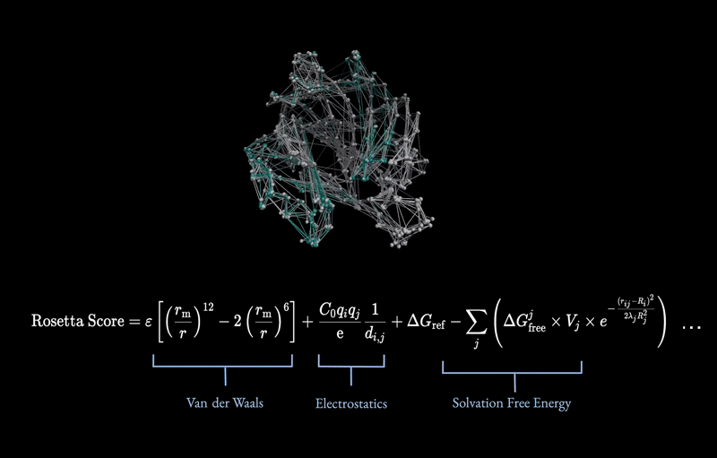

# Pro-1

[](https://github.com/michaelhla/pro-1)
[](https://twitter.com/hla_michael)
[](https://huggingface.co/mhla/pro-1)
[](https://michaelhla.com/blog/pro1.html)

Pro-1은 단백질 안정성을 위한 물리 기반 보상 함수를 사용하여 GRPO로 학습된 추론 모델입니다.

단백질 서열 + 단백질에 대한 텍스트 설명 + 이전 엔지니어링 시도 결과를 입력받아 주어진 정보를 추론하고 주어진 서열의 안정성을 개선하기 위한 수정을 제안합니다.



# Pro-1 실행:

요구 사항:
- 드라이버가 설치된 NVIDIA GPU 인스턴스, A100 80GB에서 가장 잘 작동하지만 더 작은 GPU에서도 실행 가능
- 8b의 경우 최소 60GB, 70b의 경우 200GB의 저장 공간

1. 리포지토리를 복제하고 GPU 인스턴스에 ssh로 접속한 후 다음을 실행합니다:

```
bash setup.sh
source venv/bin/activate
```

2. 어댑터 가중치를 다운로드하려면 다음을 실행합니다:

```
bash hf_download.sh
```

다른 체크포인트를 사용하려면 hf_download 스크립트를 수정하고 all_lm_grpo_mega_run을 원하는 체크포인트 이름으로 바꿉니다. 기본값은 8b 창의성 조정 모델입니다.

(선택 사항) 기본 pro-1 디렉터리에 .env 파일을 만들고 OPENAI_API_KEY=your_api_key_here를 붙여넣습니다. 이는 LM 서열 적용기를 사용하려는 경우에만 필요합니다. pro1_inference.py에서 use_lm_applier=True로 설정해야 합니다.

3. pro1_inference.py에서 단백질 데이터 필드를 설정합니다:

```
    # 단백질 서열
    PROTEIN_SEQUENCE = "" ## 여기에 일반 서열

    # 효소 정보 정의
    ENZYME_DATA = {
        # 기본 효소 정보
        "name": "Human Carbonic Anhydrase II",  # 효소 이름
        "ec_number": "4.2.1.1",  # EC 번호 (사용 가능한 경우)

        # 반응 세부 정보
        "reaction": [{
            "substrates": ["Carbon dioxide", "Water"],  # 기질 목록
            "products": ["Bicarbonate", "H+"]  # 생성물 목록
        }],

        # 중요한 잔기 및 보조 인자
        "metal_ions": [],  # 금속 이온 또는 보조 인자 목록 (예: ['Zn+2', 'Mg+2'])
        "active_site_residues": [],  # 예: ["H64", "H19", "H198", "H200"]

        # 추가 정보 (비워둘 수 있음)
        "general_information": """

        효소에 대한 간략한 설명과 관련 문헌.
        이전 연구의 주요 결과 또는 중요한 특징을 포함합니다.
        프롬프트에서 가장 유연한 필드이며, 이 문자열을 원하는 내용으로 바꾸세요.

        """, ## 이 문자열을 단백질에 대한 일반 정보로 바꾸세요.

        # 알려진 돌연변이 (선택 사항)
        "known_mutations": [
            # 각 돌연변이와 효과가 있는 사전 목록을 받습니다.
            # 예시 돌연변이, 이 형식이어야 합니다.
            # {
            #     "mutation": "W19A",
            #     "effect": "돌연변이 효과에 대한 설명"
            # },
            # 필요에 따라 더 많은 돌연변이 추가
        ]
    }
```

4. 모델 구성 수정

```
    # 모델 구성
    MODEL_CONFIG = {
        "checkpoint_path": "all-lm-grpo-mega-run/checkpoints/checkpoint-20250225-025056-step40", # 사용하려는 체크포인트에 따라 변경
        "max_iterations": 10,  # 최적화 반복 횟수
        "max_length": 32768  # 최대 서열 길이
    }
```

5. 다음으로 스크립트를 실행합니다:

```
python pro1_inference.py
```
참고: 모델은 효소에 대해 특별히 학습되었지만 모든 단백질 서열에서 작동해야 합니다. 이것이 사실인지 궁금합니다!

면책 조항: 이것은 미리보기 버전이므로 모델이 매우 어리석을 수 있습니다. 수정된 서열에 올바른 돌연변이가 적용되었는지 항상 다시 확인하십시오. 모델의 모든 참조는 환각이라고 가정합니다.
